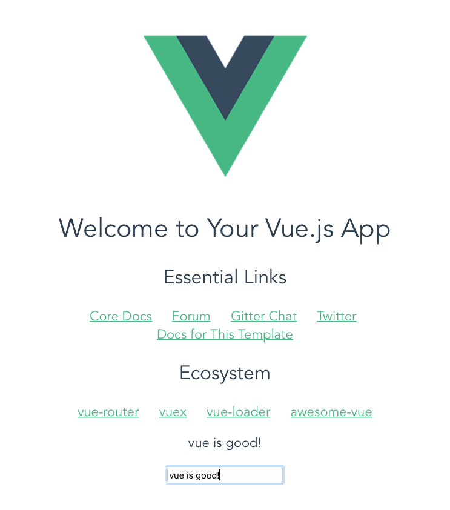
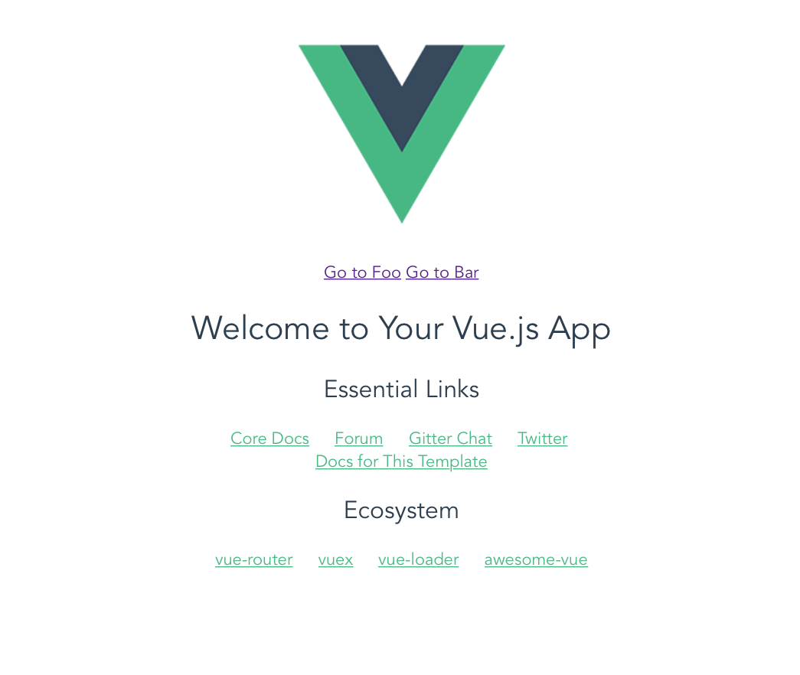
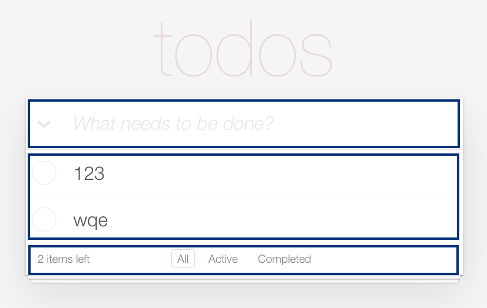
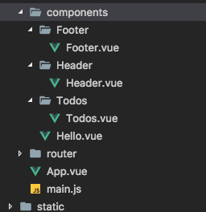
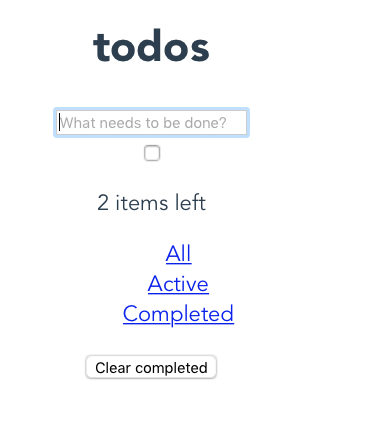
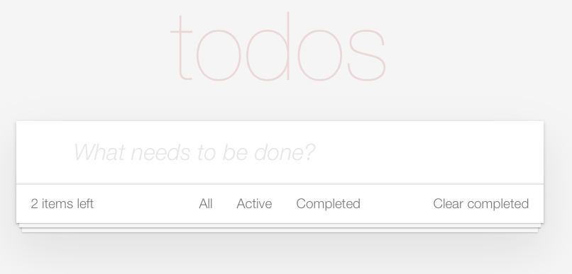
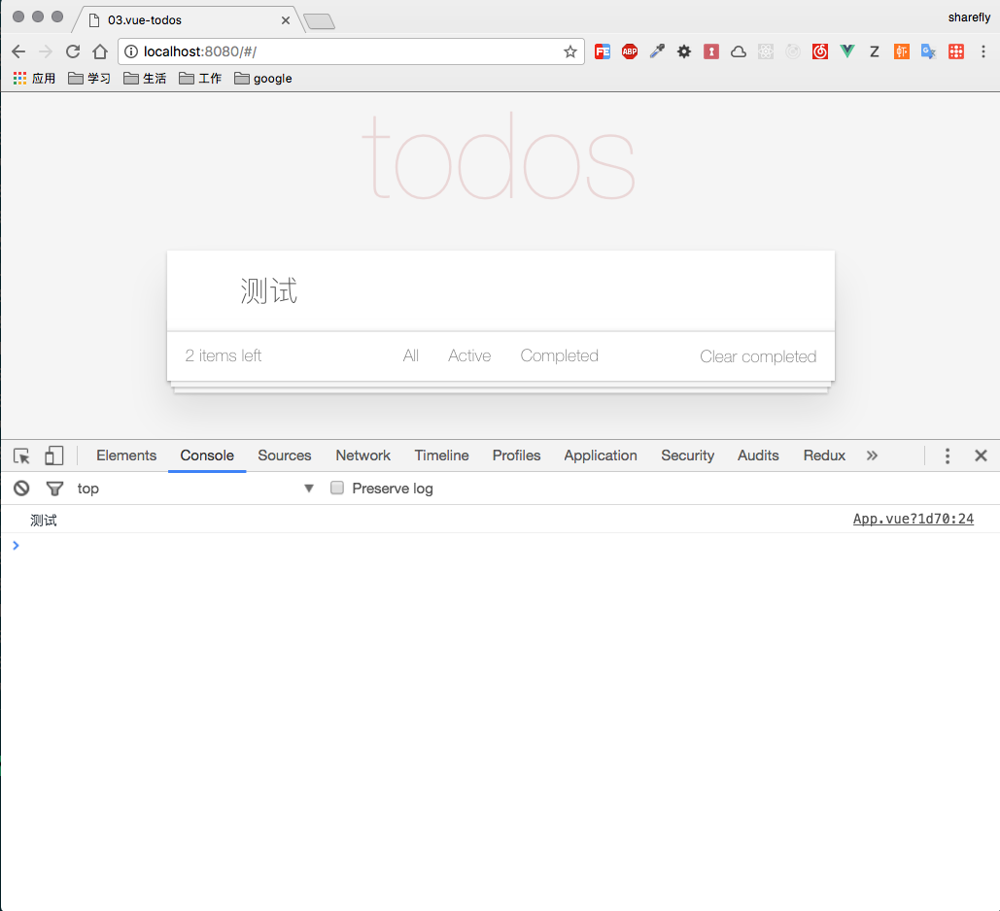
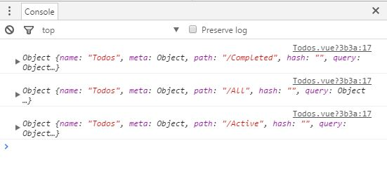

# vue2.0-tutorial
一个vue2.0的教程，带你一步一步学习vue2.0相关技术栈，在这里，你可以学到vue2.0组件式开发、使用vue-router开发SPA应用、使用vuex管理应用状态等。

## lesson01.vue-cli
vue-cli是vue官方提供的脚手架，可以快速根据配置生成项目，第一讲是vue2.0的入门，就从官方的`vue-cli`开始把，可以避免新手专注于学习vue相关语法，避免在环境配置方面浪费太多时间。

`vue-cli` github地址：[vue-cli](https://github.com/vuejs/vue-cli)

接下来就根据github的文档来安装vue-cli：
首先把vue-cli安装为全局包
````
$ npm install -g vue-cli
````
安装完毕后，进入你要生成项目的路径，使用vue-cli命令生成项目，vue-cli的生成项目的语法为：
````
$ vue init <template-name> <project-name>
````

template-name可选项如下
1. webpack - A full-featured Webpack + vue-loader setup with hot reload, linting, testing & css extraction.
2. webpack-simple - A simple Webpack + vue-loader setup for quick prototyping.
3. browserify - A full-featured Browserify + vueify setup with hot-reload, linting & unit testing.
4. browserify-simple - A simple Browserify + vueify setup for quick prototyping.
5. simple - The simplest possible Vue setup in a single HTML file

project-name为你生成项目的名称
举个栗子：
````
$ vue init webpack 01.vue-cli
````

回车后，项目生成的时候会提示你输入项目名称，是否需要安装vue-router等配置项，这里我们就按照默认项来，一路回车到底，项目就生成了，我们进入到项目01.vue-cli的目录
````
$ cd 01.vue-cli/
````

安装相关的依赖项，并运行项目
````
$ npm install
$ npm run dev
````

正常来说命令执行成功后，浏览器会自动打开[http://localhost:8080/#/](http://localhost:8080/#/)，显示模板项目的主页

让我们来在模板项目上加一点官网案例，熟悉一下vue语法以及应用，项目源码放在了src目录下，这里我们可以发现项目结构如下：
````
|src // 源码路径
|--assets // 静态资源
|--components // vue组件目录
|----Hello.vue 
|--router // 路由目录
|----index.js
|--App.vue // vue root components
|--main.js // 项目入口
````
分析一下App.vue文件
````html
<template>
  <div id="app">
    
    <router-view></router-view>
  </div>
</template>
````
可以发现Hello.vue作为App.vue的子组件，所以我们这里直接在hello.vue上写测试代码，这里我们实现一个小小的需求，界面上有两个元素，一个文本域，一个输入框，文本域的内容根据输入框的输入信息自动更新。

打开Hello.vue，尝试在`<templete></templete>`中的`<div class="hello">...</div>`节点后增加一个`<div id="demo"></div>`
界面立即响应变化，报错了，报错信息如下：
>Component template should contain exactly one root element. If you are using v-if on multiple elements, use v-else-if to chain them instead.

组件的templete不允许包含超过一个根元素，这个和react的jsx控制规则是一样的，所以我们把`<div id="demo"></div>`移动到`<div class="hello">...</div>`中，作为其子元素
````html
<div id="hello">
...
    <div id="demo">
      <p>{{ message }}</p>
      <input type="text" v-model="message"/>
    </div>
</div>
````
在script中，我们加了一个message，使其数据可响应
````javascript
export default {
  name: 'hello',
  data () {
    return {
      msg: 'Welcome to Your Vue.js App',
      message: ''
    }
  }
}
````

so，我们就完成了这个简单的需求，是不是非常easy，vue帮我们处理了数据与DOM之间的更新与变化，界面上所有的东西都可以看做是数据的映射，只要操作数据，界面会根据组件的配置自动更新，使我们能把精力放在行为和业务上，大大提高了编码生产力，同时，vue会很聪明的处理更新的队列，把同一个事物里的变化只做一次提交，而且只修改DOM变化的部分。

好了，您也来试试把。

````
$ cd lesson/01.vue-cli
$ npm install
$ npm run dev
````


## lesson02.vue-router
这一节中，我们将学习vue，vue-router的集成和应用，做一个简单的SPA。
首先说一下路由的概念，为什么要有前端路由呢，使用前端路由是为了把多页应用改造成单页应用，单页应用利用浏览器的地址模拟了多页应用不同地址渲染不同功能的需求，同时避免了路由跳转的时候重新请求服务端获取数据重新渲染页面。

这节课的需求是：在界面上定义两个链接，点击其中一个链接渲染对应的vue子组件页面
对于vue-router不熟的同学可以先看看概念：[vue-router](https://router.vuejs.org/zh-cn/)

现在我们来分析一下，我们需要定义链接的组件应该是根组件App.vue，偷懒一下，直接把官网的demo拷进去
````html
<template>
  <div id="app">
    
    <p>
      <!-- 使用 router-link 组件来导航. -->
      <!-- 通过传入 `to` 属性指定链接. -->
      <!-- <router-link> 默认会被渲染成一个 `<a>` 标签 -->
      <router-link to="/foo">Go to Foo</router-link>
      <router-link to="/bar">Go to Bar</router-link>
    </p>
    <!-- 路由出口 -->
    <!-- 路由匹配到的组件将渲染在这里 -->
    <router-view></router-view>
  </div>
</template>
````

界面定义好了，那么我们需要写两个组件：Foo&Bar，组件放在components下
````javascript
// Bar.vue
<template>
  <div>{{msg}}</div>
</template>

<script>
export default {
  name: 'bar',
  data () {
    return {
      msg: 'bar page'
    }
  }
}
</script>
````

````javascript
// Foo.vue
<template>
  <div>{{msg}}</div>
</template>

<script>
export default {
  name: 'foo',
  data () {
    return {
      msg: 'foo page'
    }
  }
}
</script>
````

组件也定义好了，怎么把组件和路由关联起来呢，打开router/index.js，把组件注册到路由中
````javascript
import Vue from 'vue'
import Router from 'vue-router'
import Foo from '../components/Foo'
import Bar from '../components/Bar'
import Hello from '../components/Hello'

Vue.use(Router)

export default new Router({
  routes: [
    {
      path: '/',
      name: 'Hello',
      component: Hello
    },
    { path: '/foo', component: Foo },
    { path: '/bar', component: Bar }
  ]
})

````

打开项目，效果是不是出来啦
````
$ cd lesson/02.vue-router
$ npm install
$ npm run dev
````


## lesson03.vue-todos
这一节，将会一步一步从零开始，完成一个todos应用，这个也是官网的例子，当应用从简单变复杂，我们要怎么去实现呢，这里我们只使用vue和vue-router来实现todos的增删改查，使用vue-router实现todos的过滤功能。

### 初始化应用

````
$ cd lesson
$ vue init webpack 03.vue-todos
$ cd vue-todos
$ npm install
$ npm run dev
````

浏览器自动打开并显示主页说明初始化成功

首先分析一下todos这个功能，从功能上可以划分为三个部分
1. 头部（Header）
2. 内容展示部分（Todos）
   2.1 列表项（todo-item）
3. 脚部过滤条件部分（Footer）





那么我们就先把组件定义出来
components/Header/Header.vue
````html
<template>
  <header class="header">
    <h1>todos</h1>
    <input 
      class="new-todo" 
      autofocus autocomplete="off" 
      placeholder="What needs to be done?" >
  </header>

</template>

<script>
  export default {
    name: 'header',
    data () {
      return {
        tip: 'What needs to be done?'
      }
    }
  }
</script>
````

components/Todos/Todos.vue
````html
<template>

  <section class="main">
    <input class="toggle-all" type="checkbox">
    <ul class="todo-list">
    </ul>
  </section>

</template>

<script>
  export default {
    name: 'todos'
  }

</script>
````

components/Footer/Footer.vue
````html
<template>
  <footer class="footer">
    <span class="todo-count">
        2 items left
      </span>
    <ul class="filters">
      <li><a href="#/all">All</a></li>
      <li><a href="#/active">Active</a></li>
      <li><a href="#/completed">Completed</a></li>
    </ul>
    <button class="clear-completed">
        Clear completed
    </button>
  </footer>
</template>

<script>
  export default {
    name: 'footer',
    data () {
      return {
        remain: '2 items left'
      }
    }
  }
</script>
````

组件定义好之后，我们需要在App.vue顶级组件中组合起来
components/Todos/Todos.vue
````html
<template>

  <section class="main">
    <input class="toggle-all" type="checkbox">
    <ul class="todo-list">
    </ul>
  </section>

</template>

<script>
  export default {
    name: 'todos'
  }

</script>
````

App.vue
````html
<template>
  <div id="app" class="todoapp">
    <Header />
    <Todos />
    <Footer />
  </div>
</template>

<script>
  import Header from './components/Header/Header'
  import Footer from './components/Footer/Footer'
  import Todos from './components/Todos/Todos'
  export default {
    name: 'app',
    components: {
      Header, Footer, Todos
    }
  }

</script>

````

好了，我们运行一下项目看看效果
````
$ npm run dev
````



### 引入TODOMVC-APP-CSS 官方TODOMVC样式

基本框架是出来了，但是缺少样式，非常难看，我们把官方的todos的样式安装一下
````
npm install --save todomvc-app-css
````
如果需要import css，并打包成js，需要安装下面三个loader
````
cnpm install style-loader --save-dev
cnpm install css-loader --save-dev
cnpm install file-loader --save-dev
````

然后在App.vue中加上
````html
<style>
  @import '../node_modules/todomvc-app-css/index.css'
</style>
````

重新运行项目，发现官方的样式全都加上去啦，现在我们又学会了一种引入第三方css的方法


现在我们打开浏览器控制台，发现了几个报错
````
Do not use built-in or reserved HTML elements as component id:
````

组件名字不要使用内置的或保留HTML元素为组件id,让我们修改App.vue的script部分如下
````javascript
import MyHeader from './components/Header/Header'
import MyFooter from './components/Footer/Footer'
import Todos from './components/Todos/Todos'
export default {
  name: 'app',
  components: {
    MyHeader, MyFooter, Todos
  }
}
````

### 父子组件通讯

现在我们开始思考Todos应用的状态数据，大概如下：
````javascript
{
    todos: [], // 存储所有todos
    visibility: 'all' // 存储当前过滤条件
}
````

那么，我们就在App.vue中先把这些数据定义在data中

> 注意，vue2.0中，组件的data定义只接受 `function`

````javascript
export default {
    name: 'app',
    data () {
      return {
        todos: [], // 存储所有todos
        visibility: 'all' // 存储当前过滤条件
      }
    },
    components: {
      MyHeader, MyFooter, Todos
    }
  }
````

那么我们要怎么监听MyHeader的输入框，并且获取数据放入todos中呢，根据vue组件间的通信规则：

> 在 Vue.js 中，父子组件的关系可以总结为 **props down, events up** 。父组件通过 **props** 向下传递数据给子组件，子组件通过 **events** 给父组件发送消息。

首先改造Header组件，使其能够监听input的键盘回车时间，并且主动触发对应的自定义事件发送消息给父组件

````html
<template>
  <header class="header">
    <h1>todos</h1>
    <input 
      class="new-todo" 
      autofocus 
      autocomplete="off" 
      placeholder="What needs to be done?" 
      v-model="newTodo"
      @keyup.enter="addTodo">
  </header>
</template>

<script>
  export default {
    name: 'header',
    data () {
      return {
        newTodo: '' // 使用v-model将input的vulue属性绑定到newTodo
      }
    },
    methods: {
      addTodo () {
        // 主动触发addTodoHandle方法，'addTodoHandle'为向父组件传递的数据
        this.$emit('addTodoHandle', this.newTodo) 
      }
    }
  }
</script>

````

我们需要把MyHeader组件绑定一个addTodoHandle事件，给App发送消息，App.vue

````html
<template>
  <div id="app" class="todoapp">
    <MyHeader @addTodoHandle="addTodo"/>
    <Todos />
    <MyFooter />
  </div>
</template>

<script>
  import MyHeader from './components/Header/Header'
  import MyFooter from './components/Footer/Footer'
  import Todos from './components/Todos/Todos'
  export default {
    name: 'app',
    data () {
      return {
        todos: [], // 存储所有todos
        visibility: 'all' // 存储当前过滤条件
      }
    },
    methods: {
      addTodo (value) {
        console.log(value) // 输出看看子组件发送的消息内容
      }
    },
    components: {
      MyHeader, MyFooter, Todos
    }
  }

</script>

<style>
  @import '../node_modules/todomvc-app-css/index.css'
</style>


````

我们在template中加了`@addTodoHandle="addTodo"`监听了组件的addTodoHandle方法，绑定到App的methods中的addTodo方法，所以子组件使用`this.$emit('addTodoHandle')`会触发父组件的`addTodo`回调方法，addTodo方法中，我们将子组件emit的数据打印出来，现在运行程序，在input中输入一些内容，按回车可以看到控制台打印的数据。



### 使用vue-router实现过滤功能

现在我们思考一下，如何用路由来实现todos的过滤，需求，当我们点击footer的a标签的时候，需要动态的改变Todos.vue的渲染内容。

那么根据第二节课程所学到的知识，我们可以把`footer`的标签当作一个`router-link`，作为路由的导航。

><router-link> 组件支持用户在具有路由功能的应用中（点击）导航。 通过 to 属性指定目标地址，默认渲染成带有正确链接的 <a> 标签，可以通过配置 tag 属性生成别的标签.。另外，当目标路由成功激活时，链接元素自动设置一个表示激活的 CSS 类名。

`router-link`组件最终编译出来的`DOM`是`a`标签，所以，我们改造一下`Footer.vue`其中的`filters`部分。
````html
<ul class="filters">
  <!-- <router-link> 默认会被渲染成一个 `<a>` 标签 -->
  <li><router-link to="/All">All</router-link></li>
  <li><router-link to="/Active">Active</router-link></li>
  <li><router-link to="/Completed">Completed</router-link></li>
</ul>
````
然后修改`App.vue`，让其支持`vue-router`动态渲染Todos组件
````html
<template>
  <div id="app" class="todoapp">
    <MyHeader @addTodoHandle="addTodo"/>
    <!-- 路由匹配到的组件将渲染在这里 -->
    <router-view></router-view>
    <MyFooter />
  </div>
</template>

<script>
  import MyHeader from './components/Header/Header'
  import MyFooter from './components/Footer/Footer'
  
  export default {
    name: 'app',
    data () {
      return {
        todos: [], // 存储所有todos
        visibility: 'all' // 存储当前过滤条件
      }
    },
    methods: {
      addTodo (value) {
        console.log(value)
      }
    },
    components: {
      MyHeader, MyFooter
    }
  }

</script>

<style>
  @import '../node_modules/todomvc-app-css/index.css'
</style>
````
接下来，修改router/index.js路由的注册，让其接受动态路由参数`filter`

````javascript
import Vue from 'vue'
import Router from 'vue-router'
import Todos from '@/components/Todos/Todos'

Vue.use(Router)

export default new Router({
  routes: [
    {
      path: '/:filter',
      name: 'Todos',
      component: Todos
    }
  ]
})

````
> 这里说明一下为啥import Todos 的路径使用@/components/Todos/Todos，这里@是当前项目的根路径下的src文件夹，在项目的build/wepack.base.config.js中定义了别名。

````javascript
resolve: {
    extensions: ['.js', '.vue', '.json'],
    alias: {
      'vue$': 'vue/dist/vue.esm.js',
      '@': resolve('src')
    }
  },
````
然后让Todos.vue测试一下，当点击`footer`的过滤条件的时候，`watch`路由的变化，并打印出来

````javascript
  export default {
    name: 'todos',
    watch: {
      '$route': function (to, from) {
        console.log(to)
      }
    }
  }
````


但是我们可以发现有一个问题，当我们点击`footer`过滤条件的时候，没有激活样式，经过翻阅`todomvc-app-css`的样式，发现激活样式是selected，而vue-router默认的激活样式如下
> 默认值: "router-link-active"

所以我们需要对`Footer.vue`做小小改动，在对应的`router-link`增加属性`active-class="selected"`支持激活样式

````html
<li><router-link to="/All" active-class="selected">All</router-link></li>
<li><router-link to="/Active" active-class="selected">Active</router-link></li>
<li><router-link to="/Completed" active-class="selected">Completed</router-link></li>
````

还有一个问题，访问应用默认的主页`localhost:8080`的时候，没有默认的indexRoute主页路由，我们想达到这样的需求，当进入默认主页的时候，让浏览器请求`localhost:8080/#/All`，即使用默认的All过滤，这时候我们需要让App.vue判断路由状态并跳转，在App.vue中script中，增加created的生命钩子
````javascript
created () {
  let filter = this.$route.params.filter
  if (!filter) {
    this.$router.replace({ path: 'All' })
  }
},
````
现在我们打开`localhost:8080`，发现会自动定向到`localhost:8080/#/All`，但是`footer`的`react-link`并没有支持，阅读官方文档，发现需要修改`Footer.vue`做以下改动，增加`exact replace`支持路由根据当前链接点亮
````html
<li><router-link to="/All" active-class="selected" exact replace>All</router-link></li>
<li><router-link to="/Active" active-class="selected" exact replace>Active</router-link></li>
<li><router-link to="/Completed" active-class="selected" exact replace>Completed</router-link></li>
````

### 使用localStorage存储应用数据
现在我们程序已经支持根据路由来动态过滤`todos`，但是对应的新建`todo`，和历史`todos`还没实现，现在我们就来一步一步实现，首先在src下定义store文件夹，作为整个程序的状态存储库，src/store/index.js文件内容如下：
````javascript
const STORAGE_FILTER_KEY = 'VUE_FILTER'
const STORAGE_TODOS_KEY = 'VUE_TODOS'
const MODEL = {
  FILTER: localStorage.getItem(STORAGE_FILTER_KEY) || 'All',
  TODOS: JSON.parse(localStorage.getItem(STORAGE_TODOS_KEY)) || []
}

export default {
  filter: {
    get: () => MODEL.FILTER,
    save: path => localStorage.setItem(STORAGE_FILTER_KEY, path)
  },
  todos: {
    fetch: () => MODEL.TODOS,
    save: () => {
      localStorage.setItem(STORAGE_TODOS_KEY, JSON.stringify(MODEL.TODOS))
    }
  }
}

````

`store`内容很简单，包括两个部分的数据存储，一个是当前`filter`的`get/set`，另一个是`todos`的`get/set`，都是使用`localStorage`作为数据的存储，现在我们需要改造`App.vue`支持新建`todo`

> 为什么需要store，因为`App.vue`和`Todos.vue`无法直接通过router共享数据`todos`，所以我们把该部分数据抽离到`store`统一维护，避免后面组件增加的时候，组件和组件之间的数据交织

````html
<script>
  import uuid from 'uuid'
  import MyHeader from './components/Header/Header'
  import MyFooter from './components/Footer/Footer'
  import Store from './store/index'
  export default {
    name: 'app',
    data () {
      return {
        todos: Store.todos.fetch() // 存储所有todos
      }
    },
    created () {
      let filter = this.$route.params.filter
      if (!filter) {
        this.$router.replace({ path: 'All' })
      }
    },
    methods: {
      addTodo (value) {
        value = value && value.trim()
        if (!value) {
          return
        }
        this.todos.push({
          id: uuid(),
          title: value,
          completed: false
        })
      }
    },
    // watch todos change for localStorage persistence
    watch: {
      todos: {
        handler: function (todos) {
          Store.todos.save()
        },
        deep: true
      }
    },
    components: {
      MyHeader, MyFooter
    }
  }

</script>
````
代码说明：
1. 首先data钩子函数对所有todos进行观察
2. 当Header触发了addTodo方法，将新建的todo压入todos中
3. app中watch钩子函数对todos进行深度的观察，当todos发生了变化，调用Store.todos.save保存

> 注意，addTodo中使用到了uuid()，这个包如果没有安装，需要安装一下 `npm i uuid --save`

`Todos.vue`也需要从`Store`中获取最新的`todos`进行展示
````html
<template>
  <section class="main">
    <input class="toggle-all" type="checkbox" >
    <ul class="todo-list">
      <li v-for="todo in filteredTodos"
        class="todo"
        :key="todo.id"
        :class="{ completed: todo.completed }">
        <div class="view">
          <input class="toggle" type="checkbox" v-model="todo.completed">
          <label>{{ todo.title }}</label>
          <button class="destroy"></button>
        </div>
      </li>
    </ul>
  </section>
</template>

<script>
  import Store from '@/store/index'
  // visibility filters
  const filters = {
    All: todos => todos,
    Active: todos => (todos.filter(todo => !todo.completed)),
    Completed: todos => (todos.filter(todo => todo.completed))
  }
  export default {
    name: 'todos',
    data () {
      return {
        todos: Store.todos.fetch(),
        filteredTodos: [] // 根据filter过滤后的todos
      }
    },
    created () {
      // 组件创建完后获取数据，
      // 此时 data 已经被 observed 了
      this.filterTodos()
    },
    watch: {
       // 如果路由有变化，会再次执行该方法
      '$route': function (to) {
        Store.filter.save(to.params.filter)
        this.filterTodos()
      },
      // 观察todos，如果todos有变化，重新执行过滤方法
      todos: {
        handler: function (todos) {
          Store.todos.save()
          this.filterTodos()
        },
        deep: true
      }
    },
    methods: {
      filterTodos () {
        let filter = this.$route.params.filter
        if (!filter) return
        const filterFun = filters[filter]
        if (!filterFun) return
        this.filteredTodos = filterFun(this.todos)
      }
    }
  }
</script>
````

现在我们需要改造一下Filter功能，我们希望默认跳转的不是`All`路由，而是用户上次点击的路由，这时候我们需要把当前路由信息保存下来,`Todos.vue`中对`route`进行观察
````javascript
watch: {
  // 如果路由有变化，会再次执行该方法
  '$route': function (to) {
    Store.filter.save(to.params.filter)
    this.filterTodos()
  }
}
````
`App.vue`中判断路由状态进行跳转
````javascript
created () {
  let filter = this.$route.params.filter
  if (!filter) {
    this.$router.replace({ path: Store.filter.get() })
  }
}
````

### 完善Todos剩余功能
#### 显示剩余 Active Todos count
需求：在`Footer`左下角显示剩余未完成的todo个数，因为`Footer`是`App`的子组件，未完成的Todos count只能从父组件中计算获取
所以改造`Footer.vue`如下
````html
<template>
  <footer class="footer">
    <span class="todo-count">
      <strong>{{ remaining }}</strong> {{ remaining | pluralize }} left
    </span>
    <ul class="filters">
      <!-- <router-link> 默认会被渲染成一个 `<a>` 标签 -->
      <li><router-link to="/All" active-class="selected" exact replace>All</router-link></li>
      <li><router-link to="/Active" active-class="selected" exact replace>Active</router-link></li>
      <li><router-link to="/Completed" active-class="selected" exact replace>Completed</router-link></li>
    </ul>
    <button class="clear-completed">
        Clear completed
    </button>
  </footer>
</template>

<script>
  export default {
    name: 'footer',
    // 声明 props
    props: ['remaining'],
    filters: {
      pluralize: function (n) {
        return n === 1 ? 'item' : 'items'
      }
    }
  }
</script>
````
改造`App.vue`，传递remaining到子组件
````html
<MyFooter :remaining="remaining"/>
````
定义计算属性
````javascript
computed: {
  remaining: function () {
    return this.todos.filter(todo => !todo.completed).length
  }
}
````
#### 双击编辑 Todo
对`Todos.vue`进行完善
1. 首先我们需要一个data记录哪一个todo属于当前编辑状态，在data中增加`editedTodo: null`
2. 在watchs增加以下四个方法，编辑Todo，移除Todo，完成编辑Todo，取消编辑Todo
````javascript
editTodo: function (todo) {
  this.beforeEditCache = todo.title // 缓存编辑前title，在cancelEdit中会用到
  this.editedTodo = todo
},

removeTodo: function (todo) {
  this.todos.splice(this.todos.indexOf(todo), 1)
},

doneEdit: function (todo) {
  if (!this.editedTodo) {
    return
  }
  this.editedTodo = null
  todo.title = todo.title.trim()
  if (!todo.title) {
    this.removeTodo(todo)
  }
},

cancelEdit: function (todo) {
  this.editedTodo = null
  todo.title = this.beforeEditCache
}
````
3. 修改templete部分
````html
<template>
  <section class="main">
    <input class="toggle-all" type="checkbox" >
    <ul class="todo-list">
      <li v-for="todo in filteredTodos"
        class="todo"
        :key="todo.id"
        :class="{ completed: todo.completed, editing: todo == editedTodo }">
        <div class="view">
          <input class="toggle" type="checkbox" v-model="todo.completed">
          <label @dblclick="editTodo(todo)">{{ todo.title }}</label>
          <button class="destroy"></button>
        </div>
        <input class="edit" type="text"
          v-model="todo.title"
          @blur="doneEdit(todo)"
          @keyup.enter="doneEdit(todo)"
          @keyup.esc="cancelEdit(todo)">
      </li>
    </ul>
  </section>
</template>
````
测试一下，编辑功能已经正常工作了，但是程序还有一个小缺陷，当双击`todo title`的时候，进入编辑模式，但是输入框`input`没有获取焦点，需要用鼠标获取焦点，比较不方便，如何让输入框进入编辑的时候可以自己获取焦点呢，我们知道在editTodo中，是操作不到DOM的，有没有其他办法呢，这里我们使用自定义指令来完成，在`Todos.vue`中增加自定义指令如下：
````javascript
directives: {
  'todo-focus': function (el, binding) {
    if (binding.value) {
      el.focus()
    }
  }
}
````
在`templete`的`input`中使用指令，条件是当todo是编辑状态
````html
<input class="edit" type="text"
  v-model="todo.title"
  v-todo-focus="todo == editedTodo"
  @blur="doneEdit(todo)"
  @keyup.enter="doneEdit(todo)"
  @keyup.esc="cancelEdit(todo)">
````

#### 删除 Todo

上一小节中我们已经完成对应的删除方法removeTodo，实现删除，我们直接绑定到对应的按钮即可，如下：
````html
<button class="destroy" @click="removeTodo(todo)"></button>
````

#### 快捷删除 Complete Todos